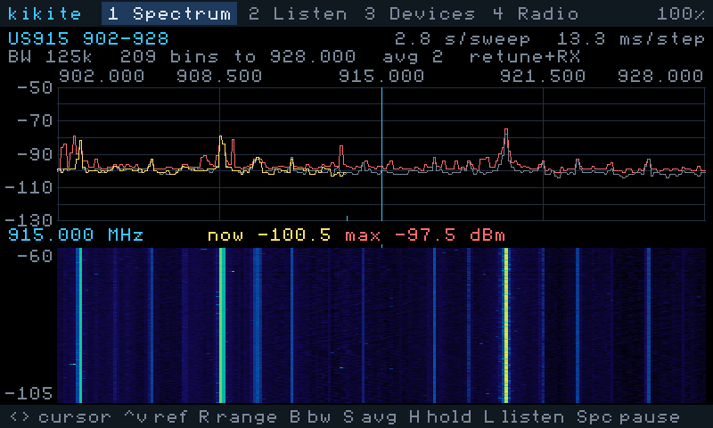
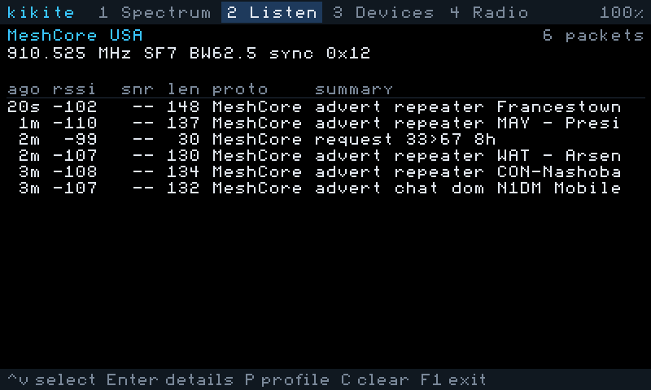
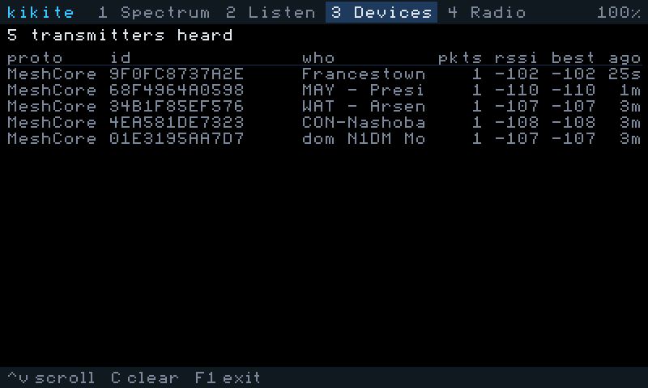

# kikite

A receive-only sub-GHz LoRa analyzer for the [Tanmatsu](https://docs.tanmatsu.cloud/). It uses the built-in LoRa radio (SX1262 for 868/915 MHz, SX1268 for 433 MHz) through the standard radio firmware, so no reflashing of the radio module is needed and Wi-Fi keeps working.



kikite never transmits. On exit it puts the radio's previous LoRa settings back, because other apps (MeshCore, for one) adopt whatever settings they find on the radio when they start.

## Tabs

| Key | Tab | What it shows |
|---|---|---|
| 1 / F2 | Spectrum | Signal strength swept across a band, with max-hold and a scrolling waterfall |
| 2 / F3 | Listen | Packets received with a chosen profile (Meshtastic, MeshCore, LoRaWAN, or a custom channel), decoded |
| 3 / F4 | Devices | Every transmitter heard: Meshtastic node IDs, MeshCore names, LoRaWAN addresses with their network operator |
| 4 / F5 | Radio | Chip, firmware, error counters, and per-step sweep timing |

F1 restores the radio and returns to the launcher.

**Spectrum:** `←/→` cursor (Shift for ×10), `↑/↓` reference level, `R` range, `B` bandwidth (62.5/125/250/500 kHz, which is also the step), `S` readings per step, `M` sweep method, `H` reset max-hold, `L` listen at the cursor frequency, Space pause.

<p>


</p>

**Listen:** `↑/↓` select a packet, Enter for decoded fields and a hex dump, Esc back, `P` next profile, `C` clear. On the custom profile, `F` spreading factor, `W` bandwidth, `Y` sync word (0x12 private/MeshCore, 0x34 LoRaWAN, 0x2B Meshtastic).

**Radio:** `G` switches between the US 915 and EU 868 region (433 MHz modules are fixed).

## What gets decoded

Only the parts each protocol sends unencrypted:

- **LoRaWAN:** message type, DevAddr, frame counter, flags, port, and the network operator (from the NetID encoded in the DevAddr, per the LoRa Alliance allocation list). Join requests show the DevEUI and JoinEUI.
- **Meshtastic:** sender and destination node IDs, packet ID, hop count, and channel hash. Packets on the default public channel (channel hash 0x08) are decrypted with the well-known default key, so node names, positions and public text messages appear. Other channels and direct messages stay encrypted.
- **MeshCore:** route type, hop count, and message type. Adverts are unencrypted, so node names, types and locations appear.

Per-packet signal strength uses the radio's "signal RSSI" value, because the radio firmware's encoding of the other RSSI field is broken (a negative float is stored into an unsigned byte in tanmatsu-lora's `lora_radio_read_data`). SNR is recovered from the firmware's encoding. The packet detail view shows the raw bytes so this can be checked against other apps.

The radio can listen with only one frequency and spreading factor at a time, so the LoRaWAN profiles hop between channels and catch a share of the traffic, not all of it. The radio driver does not apply Semtech's inverted-IQ fix (SX1262 datasheet §15.4), so some longer LoRaWAN downlinks may be missed.

## Building

ESP-IDF v6.0.2 is expected at the path in `.IDF_PATH`, and build output goes to the directory in `.BUILD_ROOT`. Both files are ignored by git; `make print-sdk` shows what is in use.

```bash
make build
```

```bash
make test-host
```

```bash
make render-host
```

`test-host` runs the decoder unit tests (LoRaWAN, Meshtastic including default-key decryption, MeshCore, and 300,000 random packets) with address and undefined-behaviour sanitizers. It needs Homebrew's `openssl@3`. `render-host` draws every tab with synthetic data into PNGs, so you can check layout changes without the device.

## Installing

Over USB with BadgeLink (put the Tanmatsu in USB mode with the purple diamond key first):

```bash
make install
```

From an SD card, with no cable: `make package` produces `io.github.dmd.kikite/` in the build directory. Copy that folder into `apps/` on the card. The launcher lists it and copies it into app storage on first launch, and again whenever the `revision` number changes.

## Remote control and telemetry over USB

With the Tanmatsu running kikite and connected by USB (debug mode, not BadgeLink), the USB serial port accepts line commands:

| Command | Effect |
|---|---|
| `telemetry on` / `telemetry off` | Stream data lines (off by default, so kikite never waits on an absent host) |
| `key <characters>` | Press keys, e.g. `key m` cycles the sweep method, `key 2p` opens Listen and picks the next profile |
| `nav <left/right/up/down/return/esc/f1-f5>` | Press a navigation key |
| `status` | Print one status line |
| `display off` / `display on` | Stop drawing and turn the backlight off, or restore it (for interference tests) |
| `screenshot` | Dump the framebuffer (run-length encoded, base64, `@F` lines); `tools/fetch_screenshot.py link.log out.png` turns the last dump into a PNG |

Data lines start with `@`: `@S` is one completed sweep (geometry, method, timing, error counts, and every bin in dBm×2), `@P` is one received packet (channel settings, signal, raw radio stats, decoded summary, payload hex), `@I` is status, `@A` acknowledges a command and `@E` reports an error.

`tools/kikite_link.py --port /dev/cu.usbmodem… --log link.log --fifo link.fifo` keeps the port open, appends everything to the log, and sends each line written to the named pipe as a command. `tools/analyze_sweeps.py link.log` summarizes the sweeps per method: timing, noise floor, strongest bins, sweeps with a block of raised readings, and how closely the methods agree.

## First hardware test

The sweep's speed and correctness depend on how the radio firmware handles retuning, which can only be measured on the device. With USB connected:

1. `make install`, start kikite, and stay on the Spectrum tab for about 30 seconds.
2. On the Radio tab, note the timing numbers and whether "Signal readings" says working.
3. Press `M` on the Spectrum tab to try each sweep method (retune, retune+RX, standby+retune+RX), and compare ms/step and how the traces look. If "retune" gives the same picture as the others, it is the fastest valid method and should become the default.
4. On the Listen tab, try Meshtastic LongFast and MeshCore USA, and check that packets decode. Open a packet (Enter) and compare its RSSI with what MeshCore or Meshtastic shows for the same node; the "raw radio stats" line is there to diagnose a mismatch.
5. Exit with F1, then open MeshCore or Meshtastic and confirm their radio settings were left alone.

`make monitor PORT=/dev/cu.usbmodem…` shows the log, including the radio's saved settings at startup and any command errors.

## License

MIT. See [LICENSE](LICENSE).
